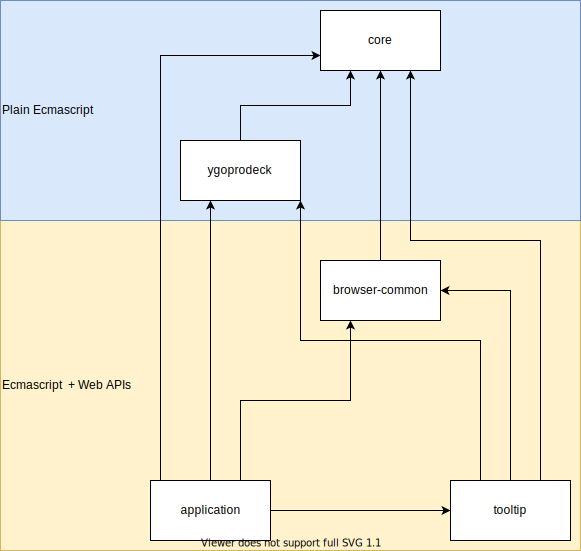

# Architecture

### Packages

- `core`: Shared business logic.
- `ygoprodeck`: The API access to the [YGOProDeck API](https://db.ygoprodeck.com/api-guide/).
- `browser-common`: Shared UI logic/styling requiring a browser.
- `tooltip`: Card tooltip. Entry point.
- `application`: Vue app. Entry point.

#### Dependency Tree

### IoC

Dependency injection is done via [InversifyJS](https://github.com/inversify/InversifyJS). Non-entry
point packages provide modules with dependency configuration. Entry-point packages use these to
create containers.
